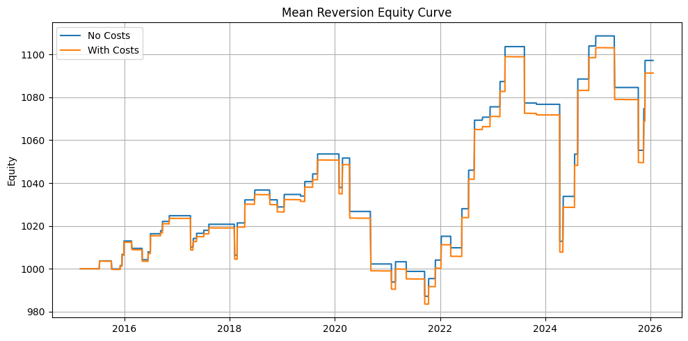
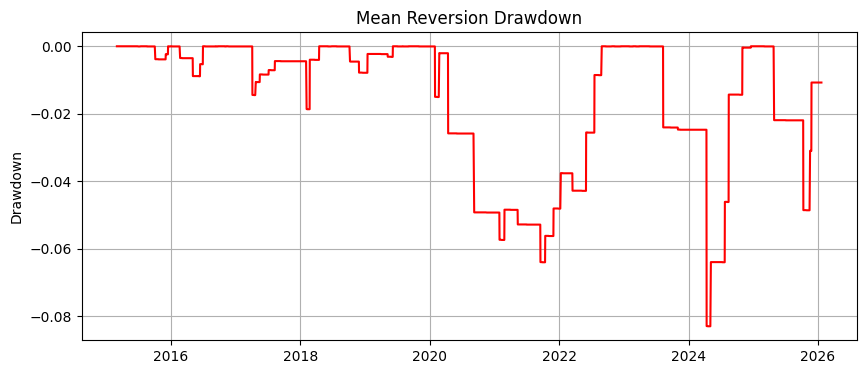
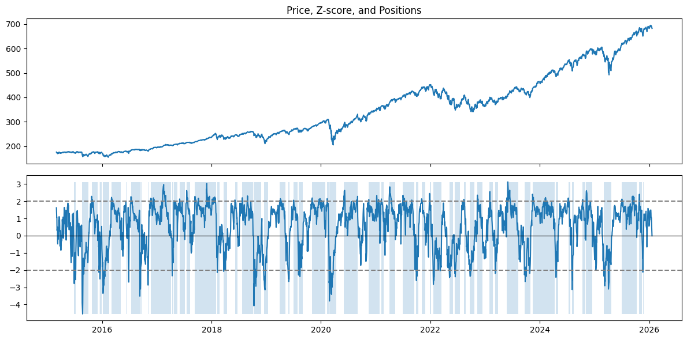
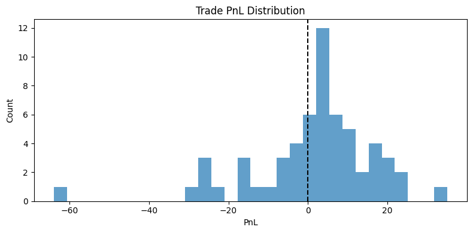
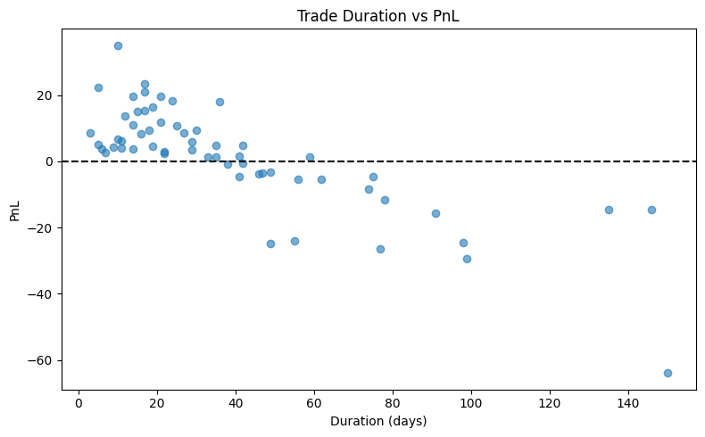
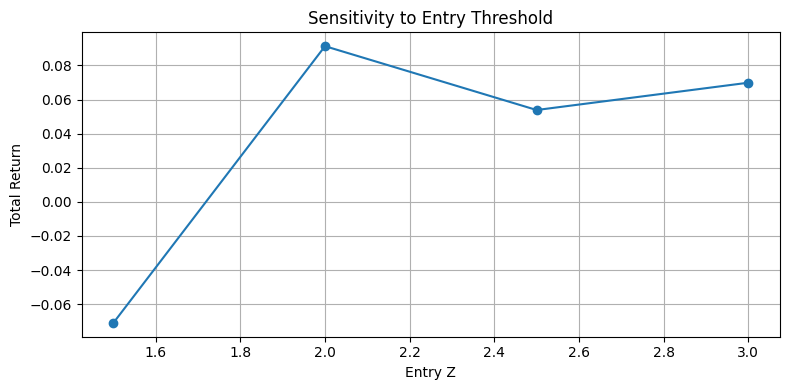

# Project: Limits of Short-Horizon Predictability in Equity Prices

## Summary

This project studies whether short-horizon equity returns contain exploitable structure once realistic noise and trading frictions are taken into account. We examine this through two complementary approaches:

1. **Rule-based mean reversion signals** derived from price deviations
2. **Feature-based classification models** trained to predict short-term returns

Across both approaches, apparent predictability is fragile and degrades rapidly under transaction costs, parameter perturbations, and regime changes. The results suggest structural limits to short-horizon predictability rather than deficiencies in model choice.

## Motivation

Short-horizon trading strategies often appear profitable in backtests, especially when evaluated without costs. However, at these horizons, microstructure noise, regime dependence, and transaction costs dominate small statistical edges.

The goal of this project is not to construct profitable alpha, but to understand:

- when predictability appears
- why it disappears,
- and how sensitive it is to modeling assumptions

This framing intentionally prioritizes insight over performance.

## Approach 

### 1. Mean Reversion Signals

We construct a simple mean reversion signal based on the Z-score of the price relative to a rolling mean and vol estimate. Trades are entered when price deviates sufficiently from its recent average and exited upon reversion.

Key characteristics:

- Single-asset, long/short
- No leverage, simple position logic
- Transactions costs applied symmetrically at entry and exit

This setup isolates the structural behavior of mean reversion without relying on complex modeling.

### 2. Feature-Based Classification

We also test whether short-horizon returns are predictable using standard features such as:

- recent returns,
- moving average ratios,
- volatility measures,
- price relative to rolling bands.

A simple Logistic Regression classifier is used to avoid overfitting. The classification model is evaluated both statistically (ROC/AUC) and economically (backtest).

## Experimental Design

To avoid overstating results, we follow a deliberately conservative design:

- Strict train/test splits based on time
- Minimal hyperparameter tuning
- Sensitivity analysis over key thresholds
- Transaction cost modeling
- Evaluation across multiple assets

No attempt is made to optimize parameters for peak backtest performance.

## Results

### Mean Reversion

**Figure 1. Mean Reversion Equity Curve (With vs Without Costs)**


*The strategy appears mildly profitable in an idealized, cost-free setting. However, even modest transaction costs eliminate most of the apparent edge, highlighting the fragility of short-horizon mean reversion.*

---

**Figure 2. Drawdown Profile**


*Drawdowns are large relative to cumulative returns, indicating an unfavorable risk-reward tradeoff.*

---

**Figure 3. Price, Z-Score, and Positions**


*While some price reversions occur as expected, extended deviations during trending regimes lead to sustained losses.*

---

**Figure 4. Trade PnL Distribution**


*The payoff distribution consists of many small gains punctuated by fewer but larger losses, explaining the observed drawdowns.*

---

**Figure 5. Trade Durations vs PnL**


*Longer holding periods do not reliably improve outcomes; losses often arise from waiting for reversion that fails to materialize.*

---

**Table 1. Mean Reversion Strategy Summary**
|   Total Return |   Sharpe |   Max Drawdown |   Win Rate |   Avg Trade PnL |   Num Trades |
|---------------:|---------:|---------------:|-----------:|----------------:|-------------:|
|      0.0913235 | 0.248637 |     -0.0830123 |   0.661017 |         1.64786 |           59 |

*Risk-adjusted performance remains weak, with drawdowns dominating returns.*

---

**Table 2. Transaction Cost Impact**
| Scenario   |   Total Return |
|:-----------|---------------:|
| No Costs   |      0.0972235 |
| With Costs |      0.0913235 |

*Even small transaction costs are sufficient to remove apparent profitability.*

### Classification

**Figure 6. Classification Strategy vs Buy-and-Hold**


*Weak statistical predictability remains close to random, indicating limited separability of short horizon returns using standard features.*

---

**Figure 8. Sensitivity to Decision Threshold**


*Performance is unstable across decision thresholds, suggesting the absence of a robust operating regime.*

---

**Table 3. Classification Metrics**
|   Accuracy |   Precision |   Recall |       F1 |      AUC |
|-----------:|------------:|---------:|---------:|---------:|
|   0.577899 |    0.586338 | 0.953704 | 0.726204 | 0.486274 |

*Statistical gains are marginal and insufficient to support a reliable trading strategy.*

---

**Table 4. Classification Strategy Summary**
|   Total Return |   Sharpe |   Max Drawdown |   Win Rate |   Avg Trade PnL |   Num Trades |
|---------------:|---------:|---------------:|-----------:|----------------:|-------------:|
|       0.684523 |  1.62525 |      -0.170666 |          0 |               0 |            0 |


## Key Insights

1. Apparent predictability at short horizons is fragile
2. Complexity does not rescue weak signal
3. Drawdowns dominate performance
4. Failure modes are structural, not implementation dependent

## Repository Structure

```graphql
core/
  signals.py        # signal/model construction
  features.py       # feature definitions
  backtest.py       # backtest engines
  metrics.py        # risk and performance metrics
  utils.py          # reusable utils (general, plotting, tabulation)

experiments/
  mean_reversion.ipynb
  classification.ipynb

archive/
  exploratory and unused experiments
```

## Takeaway

This project demonstrates that short-horizon equity predictability is limited not by modelling sophistication, but by noise, costs, and instability. Understanding why simple strategies fail is often more informative than constructing fragile successes

## Notes

This work is intended as an empirical study of predictability limits rather than a production trading system.
All results should be interpreted in that context.
